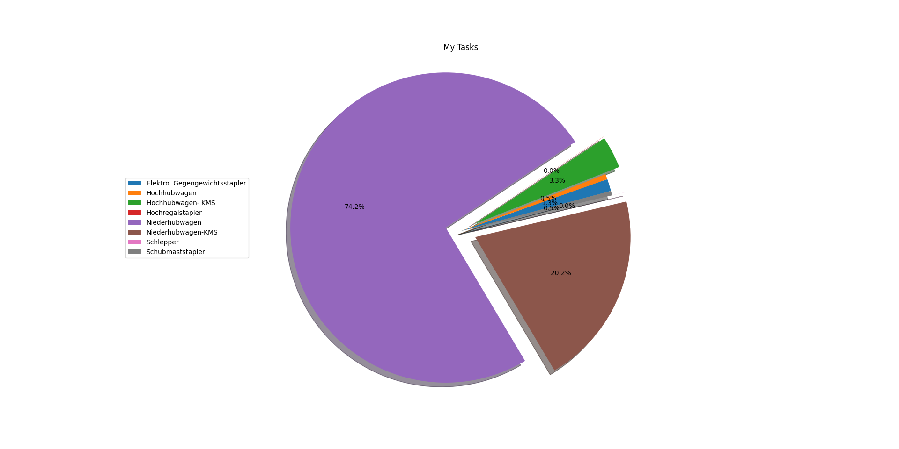

***ForkOn Coding Challenge:***
Author: Vishal Sowrirajan

Dataset Credits/Owner: https://forkon.de/

**Feature Importance**: We calculate the importance of different features that mainly contribute to our final classification score.

**Confusion Matrix**: Although the dataset is highly imbalanced, we can clearly see the our model is able to classify the Shock intensity with 95% accuracy.

**Pie chart**: 

