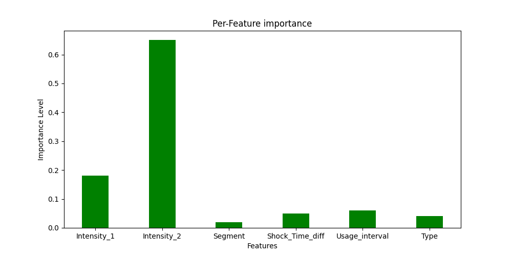
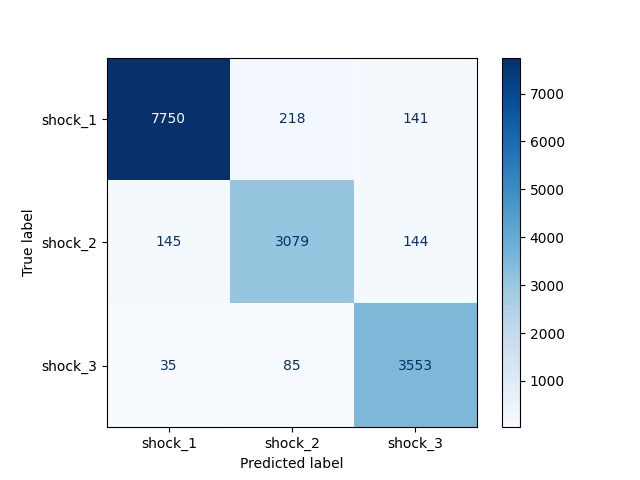

**Dataset Credits/Owner:** https://forkon.de/

**ForkOn Coding Challenge:**
Author: Vishal Sowrirajan

**Dataset Name:** 5_schocks_gestapelt_land

**Problem Statement:** 
Given the Segment, type, Time_interval_of_shock, Time_interval_of_operation and Shock_Intensity, our ML model can classify the intensity level of the shock (1, 2 or 3)

**Preprocessing:**
Pandas library was used for the below preprocessing functions:
- Data Parsing
- Null value handling
- Timestamp conversion
- Encoding categorical values to Numerical value

**Model Selection:**
The accuracy metric is set as baseline and 2 models are compared namely 'Decision Tree' and 'Random Forest'

**Model Evaluation:**
The model performance is tested against Accuracy as the metric precisely estimates our model's performance for the given dataset.

**Setup:**
The developed code was tested with Python 3.7.

To reproduce the code, run the following command:

- Download the required dependencies:
````
pip install -r requirement.txt
````

- To run the code:
````
python main.py
````

**Feature Importance**: The importance of different features is an important criteria that needs to be accounted. The feature that mainly contribute to the final classification score are given higher value in the below graph:



**Confusion Matrix**: Although the dataset is highly imbalanced, the RandomForest model is able to perfectly classify the Shock intensity with 95% accuracy.
Inference: 
- Shock_1: Out of 8109 values, 7750 values are perfectly classified as shock_1 
- Shock_2: Out of 3368 values, 3079 values are perfectly classified as shock_2
- Shock_3: Out of 3673 values, 3353 values are perfectly classified as shock_3



**Pie chart**: 
The below pie chart describes segment wise shock counts in the given dataset.


***Model Evaluation:***

| Model | Accuracy  |
|-----|-----|
| `Random Forest Classifier`| 95% |
| `Decision Tree Classifier`| 93% |

**Usage of the provided feature:**
Using this ML model, our clients can analyse the RISK for different segments and types.

**Future Scope:**
Deploy the ML model in cloud and provide a neat front-end design for our clients to provide the user-defined values as input and test the shock_intensity.
